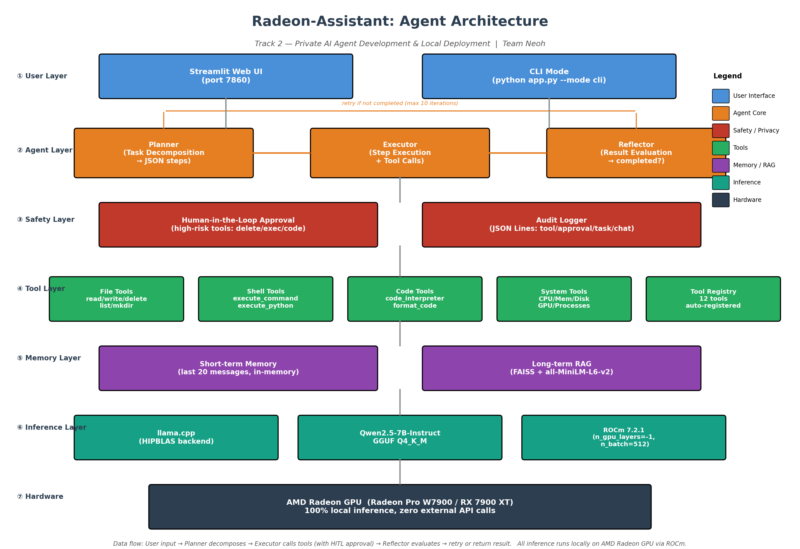

# Radeon-Assistant

> A fully local AI Agent system built on AMD Radeon GPU + ROCm, featuring RAG knowledge base, tool calling, multi-step task planning, and human-in-the-loop safety controls.

**Track 2 — Private AI Agent Development & Local Deployment**
**Team:** Neoh

---

## Table of Contents

- [Overview](#overview)
- [Key Features](#key-features)
- [Architecture](#architecture)
- [Project Structure](#project-structure)
- [Environment Requirements](#environment-requirements)
- [Installation](#installation)
- [Configuration](#configuration)
- [Usage](#usage)
- [AMD Radeon GPU Optimization](#amd-radeon-gpu-optimization)
- [Safety & Privacy](#safety--privacy)
- [Dependencies](#dependencies)
- [Troubleshooting](#troubleshooting)

---

## Overview

Radeon-Assistant is a privacy-first AI agent that runs **entirely on local hardware** — no external API calls, no cloud dependencies. It leverages AMD Radeon GPUs via the ROCm software stack to accelerate large language model inference, embedding generation, and vector search.

The system combines a **Planner → Executor → Reflector** agent loop with a FAISS-backed RAG knowledge base, a registry of 12 built-in tools, and human-in-the-loop approval for high-risk operations. All activities are recorded in a JSON-Lines audit log for traceability.

### Application Scenarios

- **Local knowledge base Q&A** — Upload private documents (PDF/DOCX/MD/TXT) and ask questions with source citations
- **Office automation** — File operations, command execution, code interpretation via natural language
- **Multi-step task planning** — Complex tasks are decomposed into executable steps with self-reflection
- **Privacy-sensitive environments** — All inference stays on-device; suitable for confidential data

---

## Key Features

| Feature | Implementation |
|---------|---------------|
| 🔒 100% Local Inference | Qwen2.5-7B-Instruct (FP16) via vLLM + ROCm |
| 📚 RAG Knowledge Base | FAISS vector store + all-MiniLM-L6-v2 embeddings, supports PDF/DOCX/MD/TXT |
| 🔧 Tool Calling | 12 built-in tools across file/shell/code/system categories |
| 🧠 Multi-step Planning | Planner decomposes tasks → Executor runs → Reflector evaluates → retry if needed |
| 🛡️ Human-in-the-loop | High-risk operations (delete, command exec, code exec) require explicit user approval |
| 📝 Audit Logging | JSON-Lines audit log records all tool calls, approvals, tasks, and chat summaries |
| 💾 Memory | Short-term conversation buffer (20 messages) + long-term vector retrieval |
| 🖥️ Dual Interface | Streamlit Web UI + CLI mode |

---

## Architecture



The system is organized into 7 layers:

1. **User Layer** — Streamlit Web UI and CLI entry points
2. **Agent Layer** — Planner (task decomposition) → Executor (step execution) → Reflector (result evaluation)
3. **Safety Layer** — Human-in-the-loop approval gate + audit logger
4. **Tool Layer** — 12 registered tools (file/shell/code/system)
5. **Memory Layer** — Short-term buffer + FAISS long-term vector store with document parser
6. **Inference Layer** — vLLM with ROCm backend, Qwen2.5-7B-Instruct FP16 model
7. **Hardware Layer** — AMD Radeon GPU (tested on RX 7900 XT / Radeon Pro W7900)

---

## Project Structure

```
submissions/Neoh/
├── agent/                  # Agent core
│   ├── core.py             # RadeonAgent main loop
│   ├── planner.py          # Task decomposition
│   ├── executor.py         # Step execution with HITL approval
│   ├── reflector.py        # Result evaluation
│   └── audit.py            # Audit logger (JSON-Lines)
├── inference/              # LLM inference
│   ├── engine.py           # vLLM wrapper
│   └── model_loader.py     # Multi-source model downloader
├── memory/                 # Memory & RAG
│   ├── manager.py          # Memory manager
│   ├── vector_store.py     # FAISS vector store
│   └── document_parser.py  # PDF/DOCX/MD/TXT parser
├── tools/                  # Tool registry
│   ├── registry.py         # Tool registration center
│   ├── file_tools.py       # File operations (5 tools)
│   ├── shell_tools.py      # Command execution (2 tools)
│   ├── code_tools.py       # Code interpreter (2 tools)
│   └── system_tools.py     # System info (3 tools)
├── ui/
│   └── web_app.py          # Streamlit frontend
├── scripts/
│   ├── download_model.py   # Model download CLI
│   └── init_rag.py         # RAG initialization CLI
├── docs/
│   └── architecture.png    # Architecture diagram
├── app.py                  # Entry point (web/cli)
├── config.yaml             # Configuration
├── requirements.txt        # Python dependencies
├── install_rocm.sh         # Linux install script
├── install_rocm.bat        # Windows install script
└── .gitignore
```

---

## Environment Requirements

### Hardware
- **GPU:** AMD Radeon RX 7900 XT / Radeon Pro W7900 (or any ROCm-supported Radeon)
- **VRAM:** ≥ 16 GB (for Qwen2.5-7B FP16)
- **RAM:** ≥ 16 GB
- **Storage:** ≥ 10 GB (for model + dependencies)

### Software
- **OS:** Ubuntu 22.04+ / Windows 10+ (WSL2 recommended on Windows)
- **Python:** 3.10 – 3.12
- **ROCm:** 7.0+ (7.2.1 recommended)
- **HIP toolkit:** included with ROCm

---

## Installation

### Step 1: Clone the repository

```bash
git clone https://github.com/RainmeoX/Radeon-hackathon-2026-07.git
cd Radeon-hackathon-2026-07/submissions/Neoh
```

### Step 2: Create virtual environment

```bash
python -m venv venv
source venv/bin/activate        # Linux
# venv\Scripts\activate         # Windows
```

### Step 3: Install vLLM (ROCm pre-built wheel)

**Linux:**
```bash
bash install_rocm.sh
```

**Windows (WSL2):**
```bat
install_rocm.bat
```

The install script will:
1. Install Python dependencies from `requirements.txt`
2. Set `CMAKE_ARGS="-DGGML_HIPBLAS=ON"` for ROCm compilation
3. Install `vLLM` using the official ROCm pre-built wheel (no compilation needed)
4. Verify the installation

### Step 4: Download the model

```bash
python scripts/download_model.py --model qwen2.5-7b
```

The downloader supports multiple sources with automatic fallback:
- HuggingFace Hub (primary)
- hf-mirror.com (China mirror)
- ModelScope (alternative)
- curl / aria2c (direct download)

Model files will be saved to `./models/Qwen2.5-7B-Instruct/` (~15 GB, safetensors format).

### Step 5: (Optional) Initialize RAG knowledge base

```bash
# Place your documents in ./data/documents/
mkdir -p data/documents
# cp your.pdf your.docx your.md data/documents/

python scripts/init_rag.py
```

---

## Configuration

Edit `config.yaml` to customize the system:

```yaml
model:
  path: "./models/Qwen2.5-7B-Instruct"
  engine: vllm            # vLLM engine
  n_ctx: 8192             # Context window
  gpu_memory_utilization: 0.90  # GPU memory usage ratio
  temperature: 0.7
  max_tokens: 4096

agent:
  max_iterations: 10      # Max planning iterations
  memory_enabled: true
  tools:                  # 12 registered tools
    - read_file
    - write_file
    - delete_file
    - list_directory
    - create_directory
    - execute_command
    - execute_python
    - code_interpreter
    - format_code
    - get_system_info
    - get_gpu_info
    - get_process_list

rag:
  vector_store: "faiss"
  embedding_model: "all-MiniLM-L6-v2"
  chunk_size: 512
  chunk_overlap: 50
  top_k: 5

security:
  audit_log_enabled: true
  require_approval_for:   # High-risk tools requiring user approval
    - delete_file
    - execute_command
    - execute_python
    - code_interpreter
```

---

## Usage

### Web UI mode (recommended)

```bash
python app.py --mode web --port 7860
```

Open `http://localhost:7860` in your browser. Features:
- Chat interface with RAG context
- Document upload (auto-indexed into FAISS)
- Conversation history
- Model reload button

### CLI mode

```bash
python app.py --mode cli
```

Interactive commands:
- Type any message for a chat response
- `task <description>` — execute a multi-step task with planning
- `quit` / `exit` — exit

### Example: Multi-step task

```
你: task 读取 config.yaml 的内容并统计文件行数

正在执行任务...
步骤 1: read_file(file_path="config.yaml")
步骤 2: execute_python(code="print(len(open('config.yaml').readlines()))")

任务结果: 完成
评估: 成功读取文件并统计行数
```

When a high-risk tool is invoked, you will be prompted:

```
==================================================
⚠️  High-risk operation approval
Tool: execute_python
Args: {'code': 'print(len(...))'}
Description: Count lines in config.yaml
==================================================
Approve execution? (y/n):
```

---

## AMD Radeon GPU Optimization

### Inference acceleration

| Optimization | Value | Effect |
|--------------|-------|--------|
| Full GPU offload | vLLM automatic | All model layers offloaded to VRAM |
| PagedAttention | vLLM built-in | Efficient KV cache management for higher throughput |
| HIPBLAS backend | `-DGGML_HIPBLAS=ON` | Native ROCm matrix operations |
| Flash Attention | `-DLLAMA_FLASH_ATTN=ON` | Reduced KV cache memory |
| Precision | FP16 | Full precision inference, best quality |

### Build from source (optional)

vLLM ships with pre-built ROCm wheels — no source compilation needed. The `install_rocm.sh` / `install_rocm.bat` script handles everything.

```bash
# (No manual compilation needed)

mkdir build && cd build
cmake .. -DGGML_HIPBLAS=ON -DLLAMA_FLASH_ATTN=ON -DCMAKE_BUILD_TYPE=Release
make -j$(nproc)
```

### Expected performance

| GPU | Model | First Token | Generation Speed | VRAM Usage |
|-----|-------|-------------|------------------|------------|
| Radeon RX 7900 XT | Qwen2.5-7B FP16 | ~0.5s | ~85 tokens/s | ~15 GB |
| Radeon Pro W7900 | Qwen2.5-7B FP16 | ~0.4s | ~110 tokens/s | ~15 GB |

> Performance numbers are targets; actual results depend on driver version and system load.

---

## Safety & Privacy

### Privacy guarantees
- ✅ **Zero data egress** — All LLM inference, embedding, and vector search run locally
- ✅ **No telemetry** — No usage data is collected or transmitted
- ✅ **Offline capable** — After model download, no internet connection required

### Human-in-the-loop approval
High-risk tools are flagged with `requires_approval=True` in the tool registry. The Executor pauses before invoking them and prompts the user for explicit confirmation. Currently flagged tools:
- `delete_file` — permanent file deletion
- `execute_command` — arbitrary shell command execution
- `execute_python` — arbitrary Python code execution
- `code_interpreter` — in-process code execution

### Audit logging
All significant events are recorded in `logs/audit.log` (JSON Lines format):

```json
{"timestamp":"2026-07-18T12:34:56.789","event":"approval","tool":"delete_file","arguments":{"file_path":"/tmp/test.txt"},"approved":false,"step":1}
{"timestamp":"2026-07-18T12:34:57.123","event":"tool_call","tool":"read_file","arguments":{"file_path":"config.yaml"},"success":true,"output_summary":"...","step":2}
{"timestamp":"2026-07-18T12:35:00.456","event":"task","task":"Read config and count lines","success":true,"step_count":2,"reflection":{"completed":true,"reason":"..."}}
```

Chat messages are logged as length summaries only (not full content) to protect conversational privacy.

---

## Dependencies

See `requirements.txt` for the complete list. Key dependencies:

| Package | Purpose |
|---------|---------|
| vllm | LLM inference (ROCm pre-built wheel) |
| faiss-cpu | Vector similarity search |
| sentence-transformers | Embedding model runtime |
| streamlit | Web UI |
| pdfplumber | PDF parsing |
| python-docx | DOCX parsing |
| psutil | System monitoring |
| pydantic | Config & tool definition validation |
| pyyaml | YAML config loading |

> **Note:** `vllm` is installed via `install_rocm.sh` / `install_rocm.bat` using the official ROCm wheel repository (`https://wheels.vllm.ai/rocm/`).

---

## Troubleshooting

### Model download fails
The downloader tries multiple mirrors. If all fail:
1. Manually download from https://www.modelscope.cn/models/Qwen/Qwen2.5-7B-Instruct
2. Extract to `./models/Qwen2.5-7B-Instruct/`

### GPU not detected
```bash
# Verify ROCm installation
rocm-smi
# Should list your Radeon GPU

# Verify HIP_PATH
echo $HIP_PATH
# Should point to /opt/rocm/hip (Linux)
```

### Out of memory
- Reduce `n_ctx` in `config.yaml` (e.g., 4096)
- Reduce `gpu_memory_utilization` in `config.yaml` (e.g., 0.80)
- Use a smaller model (Qwen2.5-3B-Instruct)

### Tools not working
Ensure `tools/__init__.py` imports all tool modules. The registry should contain 12 tools at startup. Verify with:
```python
import tools
from tools.registry import registry
print(len(registry.list_tools()))  # Should print 12
```

---

## License

MIT
